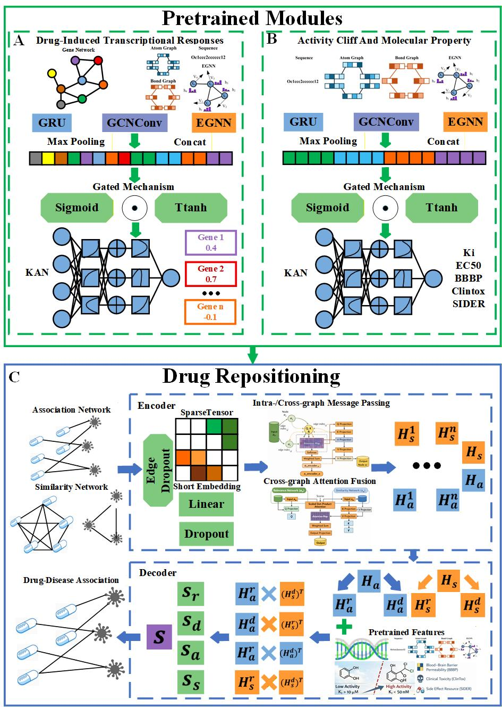

# SMD-DDA
<h1> Environment Setup  
<h1> Pretrained module-Pre_Gene   
<h4> conda env create -f gene_train/gene.yml   
<h1> Pretrained module-Pre_Cliff    
<h4> conda env create -f cliff_train/cliff_env.yml   
<h1> Pretrained module-Pre_Property   
<h4> conda env create -f property_train/property_env.yml  
<h1> Main Task   
<h4> conda env create -f SMD-DDA.yml  
<h1> Pretrained module Training  
<h4> python train_gene.py  
<h4> python main.py --dataset 'HEMBL239_EC50' --data_dir 'Data' --model_dir './checkpoints/'  --loss 'MSE+direction' --sim_threshold 0.9 --dist_threshold 1.0 --epochs 500 --split_method cliff --epochs 500 --num_folds 10  
<h4> python main.py --dataset 'CHEMBL244_Ki' --data_dir 'Data' --model_dir './checkpoints/'  --loss 'MSE+direction' --sim_threshold 0.9 --dist_threshold 1.0 --epochs 500 --split_method cliff --epochs 500 --num_folds 10  
<h4> python main.py --dataset 'BBBP' --data_dir 'Data' --model_dir './checkpoints/'  --loss 'BCE' --epochs 500 --split_method random  --epochs 500 --num_folds 10 --task 'classificfation' --metric auprc  
<h4> python main.py --dataset 'Clintox' --data_dir 'Data' --model_dir './checkpoints/' --loss 'BCE' --epochs 500 --split_method random --epochs 500 --num_folds 10 --task 'classificfation' --metric auroc  
<h4> python main.py --dataset 'SIDER'  --data_dir 'Data' --model_dir './checkpoints/' --loss 'BCE' --epochs 500 --split_method 'random'  --epochs 500 --num_folds 10 --task 'classificfation' --metric auprc  
<h1> Main Task Training  
<h4> python demo.py  
<h1> Illustration of the SMD-DDA framework.  

